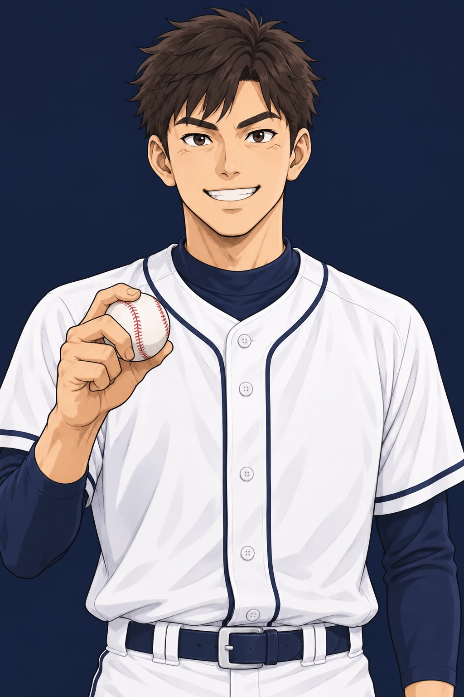
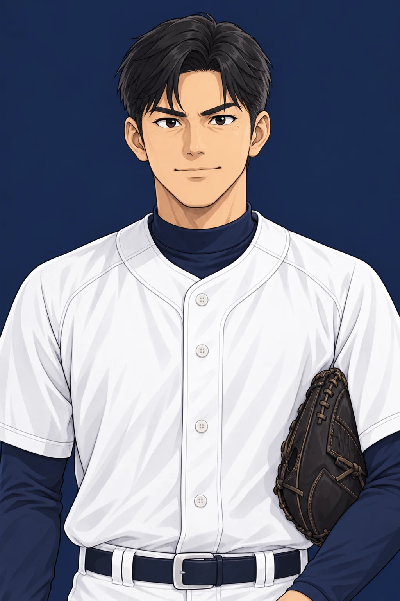
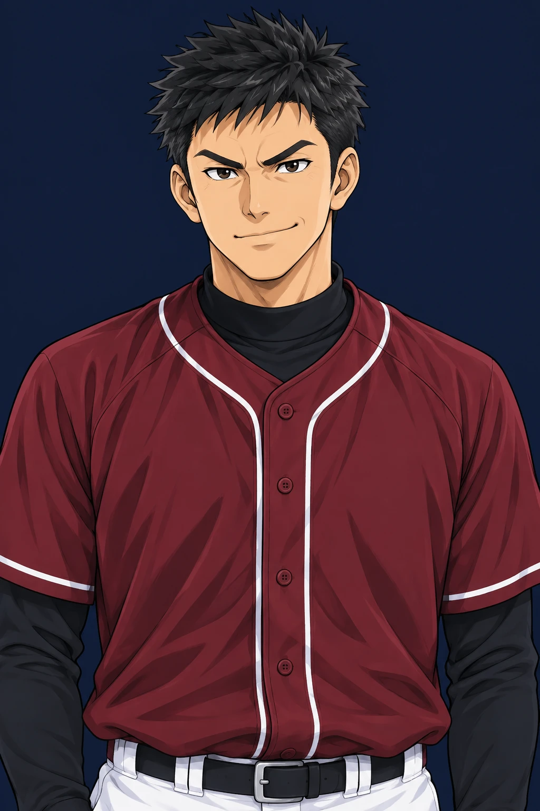
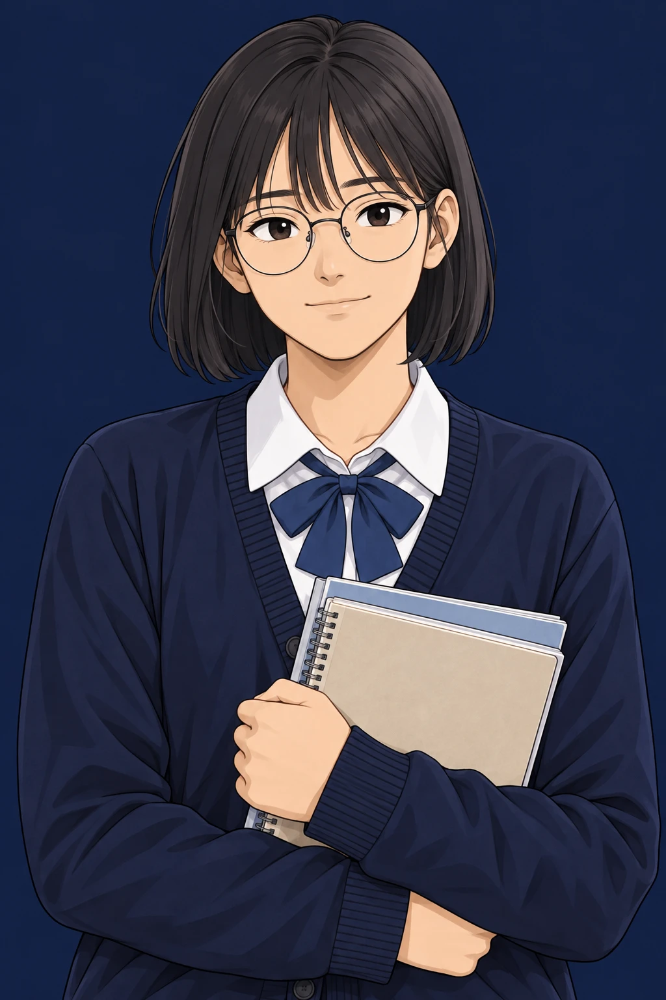
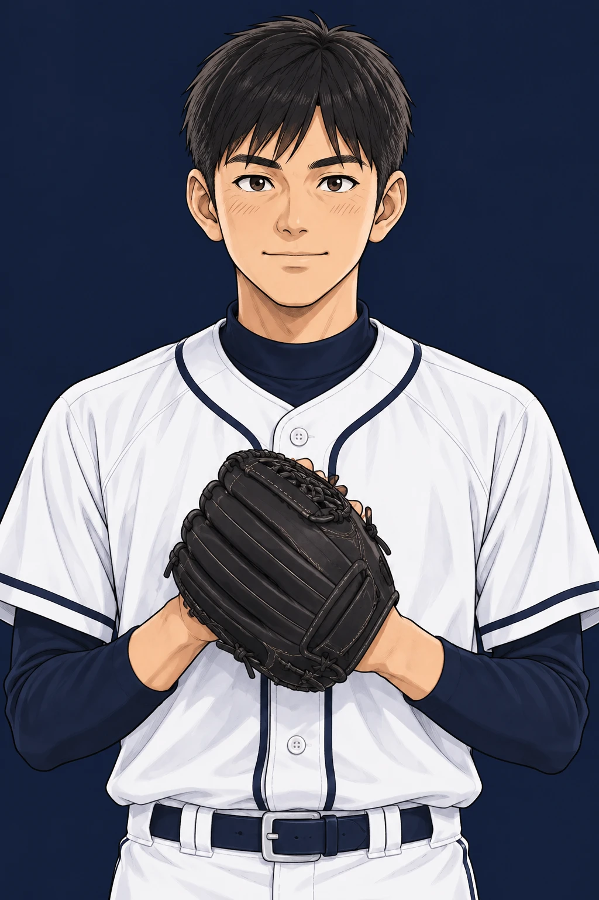

<div align="center">

# ⚾ Diamond GM

### 고교야구 선수 육성 시뮬레이션

**평범한 고1 야구부원에서 프로 지명까지.**<br>
하루 세 번의 선택이 3년 뒤의 나를 만듭니다.

<br>

[](https://sabiasagi.github.io/Diamond_GM/)


<br>





</div>

<br>

## 📖 어떤 게임인가요?

**Diamond GM**은 한국 고교야구를 배경으로 한 선수 육성 게임입니다.

전국 **91개 실제 고교 야구부** 중 한 곳에 입학해, 고1 3월부터 고3 졸업까지 3년을 **하루 단위**로 살아갑니다.
아침엔 수업을 듣고, 오후엔 훈련장에서 땀을 흘리고, 밤엔 개인 훈련을 하거나 친구를 만나러 갑니다.

주전 자리를 두고 동기와 경쟁하고, 황금사자기·청룡기·봉황대기와 전국체전 무대에 서고, 라이벌을 넘어서세요.
그 3년의 끝에서 KBO 지명, 해외 진출, 대학 진학 중 어떤 길이 열릴지는 당신의 선택에 달려 있습니다.

> 설치 없이 브라우저에서 바로 플레이할 수 있고, 진행 상황은 브라우저에 자동 저장됩니다. PC와 모바일 모두 지원합니다.

<br>

## 🗓️ 하루는 이렇게 흘러갑니다

| 시간 | 🌅 오전 | ☀️ 오후 | 🌙 야간 |
| :--: | :--: | :--: | :--: |
| **평일** | 정규 수업 | 야구부 훈련 · 경기 | 개인 훈련 · 휴식 · 외출 |
| **주말 · 방학** | 자율 활동 | 주말리그 · 연습경기 | 자유 시간 |

학사일정에 따라 시험, 수학여행, 방학이 찾아오고 선택지도 그에 맞춰 달라집니다.
체력이 떨어졌는데 무리하면 부상을 당할 수 있으니 휴식도 전략입니다.

<br>

## ✨ 주요 시스템

<table>
<tr>
<td width="50%" valign="top">

### 🧢 나만의 선수 만들기
- 전국 91개 고교 중 입학할 학교 선택
- 투수 · 야수 · **투타겸업** 포지션
- 투구 폼 · 타격 폼 · 우투좌타 등 세부 설정
- 남녀 선수 프리셋과 외형 커스터마이징
- 첫날 감독 면담에서 3년의 목표 설정

</td>
<td width="50%" valign="top">

### 📈 성장
- 컨택 · 파워 · 선구안 · 구위 · 제구 등 세부 능력치
- 포심부터 변화구까지 **구종 습득** (XP 방식)
- 겨울방학에만 열리는 **동계 훈련** (서킷 · 웨이트 · 실내 불펜 · 티배팅)
- 배트 · 글러브 · 스파이크 등 **장비 8슬롯**
- 동학년 **전국 상위 %** 비교, 월간 성장 리포트

</td>
</tr>
<tr>
<td width="50%" valign="top">

### 🏆 대회와 주전 경쟁
- 이마트배 · 황금사자기 · 청룡기 · 봉황대기
- 6월 시·도 대표 선발전을 뚫고 나가는 **전국체전**
- 조 추첨 → 조별 예선 → 16강 → 결승
- 주말리그 · 청백전 · 연습경기
- 벤치 → 백업 → 주전 → **핵심 선수**로 올라서는 팀 내 서열
- 감독 면담으로 출전 기회 요청 · 포지션 변경

</td>
<td width="50%" valign="top">

### 💞 인연과 이야기
- 감독, 동기, 라이벌, 소꿉친구 등 **13명과의 개별 인연**
- 동기·라이벌·친구들은 **매 회차 이름 · 성별 · 외모가 새로** 정해짐
- 관계가 깊어질수록 훈련 · 경기 보너스
- 선택지에 따라 달라지는 캐릭터 대화와 이벤트
- 성별과 관계없이 열려 있는 로맨스
- 외출 · 상점 · 아르바이트

</td>
</tr>
</table>

<br>

## 👥 3년을 함께할 사람들

<table align="center">
<tr>
<td align="center"><br><b>야구부 감독</b><br><sub>당신의 출전을 결정하는 사람</sub></td>
<td align="center"><br><b>주장 선배</b><br><sub>경기 전 조언을 건네는 선배</sub></td>
<td align="center"><br><b>입학 동기</b><br><sub>친구이자 포지션 경쟁자</sub></td>
<td align="center"><br><b>지역 라이벌</b><br><sub>같은 지역 학교의 에이스</sub></td>
</tr>
<tr>
<td align="center"><br><b>소꿉친구</b><br><sub>어릴 적부터 곁에 있던 친구</sub></td>
<td align="center"><br><b>옆자리 단짝</b><br><sub>교실에서 가장 가까운 친구</sub></td>
<td align="center"><br><b>야구부 후배</b><br><sub>2학년부터 만나는 후배</sub></td>
<td align="center"><br><b>기술 코치</b><br><sub>폼과 구종의 스승</sub></td>
</tr>
</table>

<p align="center"><sub>주장 · 동기 · 라이벌 · 후배 · 소꿉친구 · 동네 친구 · 단짝은 매 회차 이름 · 성별 · 외모가 새로 정해집니다. 위 그림은 예시입니다.<br>이 밖에도 담임 선생님, 체육 선생님, 동네 친구, 부모님이 함께합니다.</sub></p>

<br>

## 🚧 로드맵

현재 버전은 **1.12.1**이며, **고교 1학년을 처음부터 끝까지 완주할 수 있는 v2.0**을 목표로 하고 있습니다.

- [x] 1.10 — 1학년 완주 자동 검증
- [x] 1.11 — 전국체전
- [x] 1.12 — 겨울훈련
- [ ] 1.13 — 학년 마무리 리포트
- [ ] 2.0 — 1학년 완주 완성
- [ ] 🏟️ **구단 운영(GM) 모드** — 선수 육성 모드 완성 후 개발 예정

버전별 변경 사항은 [CHANGELOG.md](CHANGELOG.md), 상세 계획은 [docs/v2.0-roadmap.md](docs/v2.0-roadmap.md)에서 볼 수 있습니다.

<br>

## 🛠️ 개발자용

<details>
<summary><b>로컬 실행 · 프로젝트 구조 보기</b></summary>

<br>

**기술 스택:** React 19 · TypeScript · Vite · Zustand · Dexie(IndexedDB)

```bash
npm install
npm run dev              # 개발 서버
npm test                 # 전체 테스트 (node:test)
npm run test:freshman    # 1학년 완주 테스트만
npm run lint             # oxlint
npm run build            # 타입체크 + 프로덕션 빌드
```

`main` 브랜치에 push하면 GitHub Actions가 테스트 · 빌드 후 GitHub Pages로 자동 배포합니다. 작업 규칙은 [AGENTS.md](AGENTS.md)를 참고하세요.

```
src/
  pages/development/   선수 육성 모드 화면 (생성 · 면담 · 대시보드)
  pages/management/    구단 운영 모드 (준비 중)
  components/          일일 생활 · 네비게이션 · 뷰 컴포넌트
  store/               게임 진행 상태 (gameClockStore)
  types/               게임 규칙 · 일정 · 대회 · 인연 로직과 타입
  data/                고교 · KBO 일정 · 이벤트 · 선택지 데이터
  styles/              화면별 CSS (index.css에서 순서대로 import)
public/assets/         캐릭터 · 초상화 이미지
docs/                  버전별 설계 문서
tests/                 node:test 테스트
```

</details>

<br>

<div align="center">
<sub>Made with ⚾ by <a href="https://github.com/SabiAsagi">SabiAsagi</a></sub>
</div>
